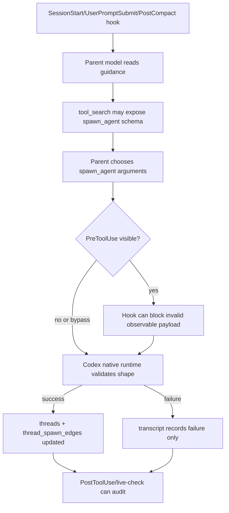

# Native Spawn First-Principles Redesign Plan

Status: superseded by implementation. This document now records the
first-principles contract that replaced the earlier default-only draft after
live Codex runtime evidence showed model-fixed native roles work when their
installed TOML uses Codex-native model ids.

## Original Goal

This project is not a generic model-routing taxonomy and not a subagent
avoidance system.

The original failure mode is:

1. The parent agent writes a long child prompt.
2. Codex native runtime rejects the spawn because the six-slot parent/session
   pool is full or because the spawn shape is invalid.
3. The parent spends more context explaining the miss, closing or retrying
   lanes, and restating the same prompt.
4. Main-thread context, tokens, and user attention are wasted before any useful
   child work happens.

The target behavior is:

- preserve native subagents as reusable context lanes;
- tell the parent how many current-parent slots are actually occupied;
- make the parent choose a model deliberately before non-fork spawn;
- reuse same-topic lanes instead of disposable spawn/close churn;
- avoid accidental frontier-model inheritance for ordinary explorer work;
- avoid the opposite drift where safety text makes the parent stop using useful
  subagents.

## Evidence Base

| Evidence | What it proves | Design consequence |
| --- | --- | --- |
| Earlier transcripts showed `agent_type="explore"` and `agent_type="researcher"` returning `agent type is currently not available` while `default` plus an explicit model succeeded. | Native type availability is a live runtime fact, not something the hook can infer from a desired semantic role. | The hook must not claim an unavailable type works, but it also must not hard-block model-fixed native roles once runtime and installed TOML prove they work. |
| Live evidence showed `agent_type="code-reviewer"` without `model` spawned successfully as `gpt-5.5/high`; `agent_type="explore"` without `model` spawned successfully as `gpt-5.3-codex-spark`. | The previous default-only hypothesis was incomplete. Installed model-fixed native roles are valid runtime shapes when their TOML uses bare Codex model ids. | Allow model-fixed native roles to omit `model`; let Codex runtime own role availability; keep explicit-model enforcement for default/legacy inherited-model shapes. Spark explore now defaults to high reasoning effort. |
| Current root cause evidence: installed native agent TOMLs inherited cached provider-prefixed model/provider metadata, but native `spawn_agent` accepts bare Codex model ids such as `gpt-5.5`. | The `agent type is currently not available` symptom can be caused by stale native agent cache/config, not by the role name itself. | Normalize generated native TOML model ids to bare Codex ids and do not emit provider binding metadata for native agents. |
| `/Users/leofitz/.codex/state_5.sqlite`, historical `threads` rows for successful probes record the runtime-created model/type/effort tuple. | Runtime state is the authority for model/type truth after a spawn, but historical rows must not be treated as current defaults. | Live-check should compare actual child rows to requested shape and distinguish runtime failures from hook unsupported-type policy. Current Spark default is high reasoning effort. |
| `/Users/leofitz/.codex/AGENTS.md`, lines 132-153 | Local runtime guidance requires explicit non-fork model and maps Spark/mini/frontier use cases. | Keep this direction, but simplify and remove any remaining scout/native-type ambiguity. |
| `/Users/leofitz/.npm-global/lib/node_modules/oh-my-codex/templates/AGENTS.md`, lines 131-149, and upstream `Yeachan-Heo/oh-my-codex/AGENTS.md` | OMX upstream still says to prefer inherited model unless there is a concrete reason. | Our package must separate Codex native spawn safety from OMX team model inheritance; upstream/template conflict must be patched or clearly overridden. |
| Historical hook versions advertised a static allowed-agent-type list and treated native role policy as hook authority. | The hook confused advisory policy with runtime capability. | Remove the default allow-list; treat configured restrictions as optional audits only. |
| Historical live-check defaults mirrored the same broad list. | Verification could falsely report a runtime role as policy-unsupported instead of identifying the real spawn failure. | Live-check should allow special native roles by default and report `agent type is currently not available` as a runtime failure. |
| `scripts/live-check.mjs`, current failure detection does not include the exact runtime output `agent type is currently not available` | The current audit can miss the real failure mode seen in both transcripts. | Add this exact string to failure detection and fixture tests before claiming live-check covers native shape failures. |
| Runtime evidence plus local `AGENTS.md` model contract, not tool schema inheritance guidance | Explicit model choice is a deployment policy needed to prevent accidental parent-frontier inheritance. | Require a model-selection step for non-fork spawns; treat official model docs as supporting documentation, not runtime proof. |

## Runtime Chain

Important boundary: the hook is not Codex runtime. It can advise reliably at
prompt time, block only surfaces Codex exposes to `PreToolUse`, and audit after
the fact. Any design that assumes every native spawn is hard-blockable is false.

## Design Invariants

1. Capacity is per parent/session. There is no global subagent pool in the hook.
2. Occupancy authority is current-parent native edge state when readable.
3. Historical transcript evidence is diagnostic/fallback, not a source of new
   current occupancy when native current-parent state is authoritative.
4. `observed_free` is a snapshot, not a future reservation. A single observable
   tool call may spawn a same-call batch when `requested_spawns <= observed_free`;
   after that tool result, the parent must resample before launching another
   batch.
5. `wait_agent` and `send_input` do not free capacity.
6. `close_agent` success or verified runtime-not-found/stale-completed repair is
   what reduces the counted slot.
7. Non-fork native `spawn_agent` using an inherited-model shape (`default`,
   omitted `agent_type`, legacy `explorer`, or `worker`) must include explicit
   `model`.
8. Model-fixed native roles such as `code-reviewer`, `critic`, `explore`,
   `verifier`, and `researcher` may omit `model` because the role TOML owns the
   model and reasoning effort. Adding a conflicting `model` is unnecessary.
9. `fork_context=true` is the intentional full-history inheritance exception
   when the runtime rejects `fork_context + model`.
10. Native `agent_type` is a runtime shape. Some runtime shapes also encode a
    semantic specialist role and fixed model; legacy/default shapes do not.
11. Baseline fallback shape is `agent_type=default` plus explicit model; use it
    when a desired model-fixed native role is unavailable in this runtime.
12. Do not proactively probe native types by spawning test children just to
    learn the runtime. Learn capability passively from real successes/failures.
13. Model selection is the parent's required judgment for inherited-model
    shapes and for choosing among model-fixed roles:
    - `gpt-5.3-codex-spark`: bounded scout, anchor collection, fast repo mapping.
    - `gpt-5.4-mini`: default subagent, multi-hop read-only diagnosis,
      verifier/researcher/light executor, compact implementation support.
    - `gpt-5.5`: critic, architecture, security, high-risk/live-money judgment,
      final approval, or genuinely frontier implementation.
14. Same-topic lane reuse is a first-class path. The system should not train the
    parent to close every completed child immediately.
15. Child agents should not receive delegation-policy lectures or be asked to
    orchestrate. The parent owns spawn/close/reuse decisions.
16. Positive-budget prompt guidance must be short. Long lectures create
    attention drift and under-delegation.

## Proposed Architecture

### Layer 1: Capacity Oracle

Owner: `hooks/native-agent-pool-advisor.mjs`.

Responsibilities:

- Read `thread_spawn_edges` scoped to the current parent thread.
- Count `status=open` up to the configured cap.
- Treat more than cap rows as repair debt, not hundreds of live slots.
- Repair stale open edges only when there is child transcript or runtime evidence
  that the child already completed or no longer exists.
- Maintain a small same-turn attempt ledger only for serialization and cap-hit
  diagnosis; it must expire and must never become global occupancy authority.

Non-responsibilities:

- Choosing whether a subagent is semantically useful.
- Choosing the model.
- Advising child sessions.

### Layer 2: Spawn Shape Contract

Owner: hook prompt guidance, `AGENTS.md` deployment text, `live-check`.

Rules:

- For inherited-model non-fork shapes (`default`, omitted `agent_type`,
  `explorer`, `worker`), explicit `model` is mandatory.
- For model-fixed native roles (`code-reviewer`, `critic`, `explore`,
  `verifier`, `researcher`, and similar installed TOML roles), omit `model`;
  the role TOML owns the model and reasoning effort.
- For full-history fork, choose one:
  - `fork_context=true` without `model`; accept inheritance; or
  - remove `fork_context` and pass compact context with explicit model.
- Use model-fixed native roles when the runtime has installed configuration for
  them and their fixed model matches the task. `code-reviewer` is the correct
  native review surface; `explore` is the correct Spark locator surface.
- Use `default` plus explicit model as the fallback when a desired model-fixed
  role is unavailable or when the task needs a custom model not represented by
  an installed native role.
- Put any additional output contract, scope, and stop condition into the
  message; do not depend on `agent_type` alone to describe the task.

### Layer 3: Delegation Policy

Owner: `AGENTS.md` and docs, not the hook's verbose prompt output.

Parent decision protocol:

1. Is the subtask independent, bounded, and likely to protect main context or
   run in parallel with local work?
2. Is there an existing same-topic lane with compatible model/role and useful
   context? If yes, use `send_input`.
3. If spawning, choose model from task contract, risk, state depth, edit
   permission, and required final authority.
4. Spawn no more than the immediate PreToolUse observed-free count, then
   resample capacity before another spawn batch.
5. Retain lanes only while they remain useful for the same active task window.
   Close stale, unrelated, wrong-model, or cap-needed lanes.

### Layer 4: Live Audit

Owner: `scripts/live-check.mjs`.

Live-check must parse real transcripts and native SQLite to report:

- successful spawn count by native role/model;
- failed spawn attempts by error text;
- runtime special native `agent_type` failures, even when no child row exists;
- omitted non-fork model attempts;
- fork/model shape failures;
- same-response multi-spawn attempts;
- current-parent open edge count and overflow debt;
- close success and runtime-not-found repair evidence;
- mismatches between tool arguments and native `threads` rows.

It must not treat static tool schema or hook config as proof that an `agent_type`
is supported.

### Layer 5: OMX Boundary

OMX role names and team agent types are not Codex native `agent_type` values.

The implementation must preserve both surfaces:

- OMX team/swarm workers can keep their own `agentType` and launch-arg model
  resolution.
- Codex native `spawn_agent` uses the safe native shape contract above.
- The installed and upstream OMX `AGENTS.md` text that recommends inherited
  native model routing is incompatible with this package's safety goal and needs
  an upstream PR or a local deployment override.

## Implementation Plan After Critic Approval

### Phase 1: Separate Runtime Capability From Hook Policy

- Remove the static hook-owned "allowed native type" default. The hook should
  not be the authority that decides `code-reviewer` or `explore` are invalid.
- Treat native `agent_type` availability as Codex runtime state plus installed
  native TOML configuration.
- Keep optional allow/deny auditing only as an explicit local policy override.
- Normalize installed native agent TOMLs to bare Codex model ids and omit
  provider binding metadata, because the native runtime accepts `gpt-5.5` and
  rejects provider-prefixed cached values.
- Keep fallback examples explicit: if a model-fixed role is unavailable, retry
  with `agent_type=default` plus the intended explicit model.

### Phase 2: Make Live-Check Runtime-Truth First

- Default live-check should allow special native `agent_type` attempts and
  classify failure by runtime outcome, not by hook policy.
- Add exact runtime failure detection for:
  - `agent type is currently not available`;
  - any equivalent native role/type unavailable wording observed in future
    transcripts.
- Add transcript fixtures:
  - stale config: `agent_type=explore` fails, retry `default+spark` succeeds;
  - fixed config: `agent_type=explore` succeeds as Spark without explicit model;
  - fixed config: `agent_type=code-reviewer` succeeds as frontier without
    explicit model;
  - default Spark success has native SQLite row;
  - omitted non-fork model is detected;
  - same-response multi-spawn is detected.

### Phase 3: Compact Hook Guidance

- Positive-budget, no-lane-pressure output should be one compact contract:
  `free=N/6; same-call batch <= free; resample after tool result; explicit
  model for inherited-model shapes; fixed-role model may be omitted; reuse
  listed lanes if compatible.`
- Long guidance appears only for zero budget, invalid visible spawn shape,
  unreadable native state, narrow explicit spawn intent, or lane pressure.
- Remove wording that tells child sessions what to do.

### Phase 4: Lane Reuse and Close Accounting

- Inventory only current-parent lanes.
- Show lane id, nickname, model, status, and age/update evidence. Do not echo child task titles in runtime hook guidance; titles are offline diagnostic data only.
- Count close reductions only from successful close, runtime not-found repair, or
  stale-completed repair with evidence.
- Do not count historical closed rows or other parents.
- Keep cleanup bounded: prune old closed rows and empty ledger entries on a
  time/size threshold so state remains small.

### Phase 5: Deployment and Upstream Alignment

- Update package README/docs/page to lead with the six-slot collision problem,
  not with model taxonomy.
- Patch local `~/.codex/AGENTS.md` only as a deployment artifact.
- Open an OMX upstream PR or issue against `Yeachan-Heo/oh-my-codex` to replace
  native spawn inheritance guidance with explicit native model routing when this
  package is installed.
- Document that Codex App and CLI can differ, and live-check transcript proof is
  required for any hard-block claim.

## Verification Plan

Static checks:

- `npm run check`
- unit tests for capacity and spawn-shape helpers
- live-check failure-pattern test for `agent type is currently not available`
- fixture tests for real transcript snippets
- grep checks ensuring docs do not describe `code-reviewer`/`explore` as
  unsupported merely because older broken TOMLs failed

Runtime evidence checks:

- `node scripts/doctor.mjs`
- `node scripts/live-check.mjs --transcript <EDLI transcript>`
- `node scripts/live-check.mjs --transcript <9router transcript>`
- SQLite query of the successful child row and parent edge status

Manual live e2e checks after implementation:

1. Prompt-time guidance shows correct free slot count for the current parent.
2. A compliant model-fixed role spawn such as `code-reviewer` succeeds without
   explicit `model` when budget exists.
3. A compliant `default + explicit model` spawn succeeds when budget exists.
3. A runtime-rejected semantic type is reported by live-check as a shape failure,
   not as pool exhaustion.
4. Close/not-found evidence reduces occupancy for the owning parent.
5. Another parent session does not affect this parent's budget.

## Non-Goals

- Do not attempt to raise Codex's native six-subagent cap.
- Do not build a global pool.
- Do not auto-close every completed child.
- Do not force subagent use for small local tasks.
- Do not rely on tool schema as native capability authority.
- Do not make the hook decide the semantic usefulness of a subagent.
- Do not send delegation-policy prompts to child sessions.
- Do not proactively spawn children just to test possible native `agent_type`
  values.

## Critic Review Questions

1. Does this plan match the real Codex evidence, especially failed
   `explore`/`researcher` attempts and successful `default+model` attempts?
2. Is `default` the correct safe native baseline, or should omission of
   `agent_type` be tested and preferred only after proof?
3. Does the plan separate capacity accounting from spawn shape/model routing?
4. Does it avoid global state and keep occupancy per parent/session?
5. Does it preserve useful lane reuse instead of causing immediate close churn?
6. Does it reduce attention drift instead of adding another long hook lecture?
7. Does it correctly distinguish OMX semantic roles/team `agentType` from Codex
   native `spawn_agent.agent_type`?
8. Is the proposed verification sufficient to prove the fix in real Codex
   Desktop/CLI transcripts?
